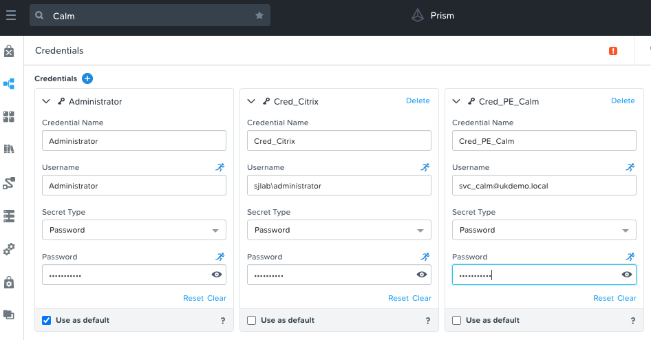
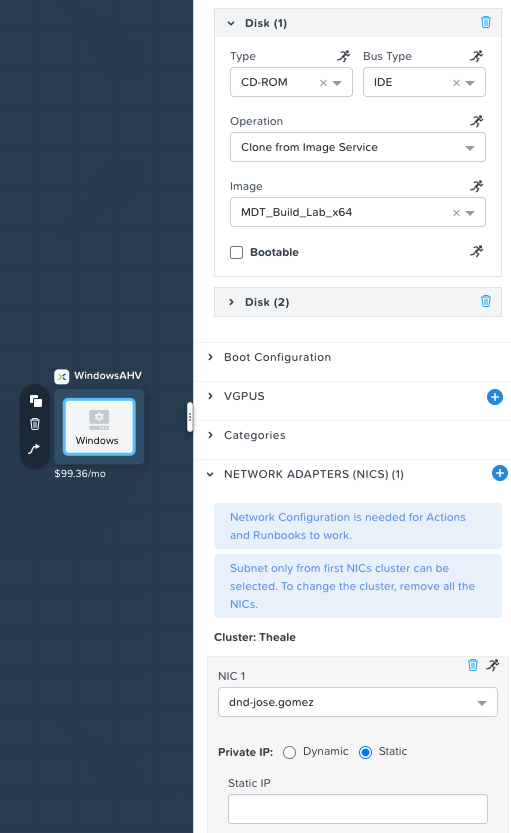

# Automating Citrix Golden Templates with Calm and MDT

---
**NOTE**

* Tested with PC 2020.9, Calm 3.1.0, MDT 6.3.8456.1000 and Citrix Studio 7.14.1.43

---

## Requirements

* Have ready Nutanix Calm with an AHV entitled project

* An existing MDT deployment with a working Deployment Share and Task Sequence that includes CVDA installation

* An existing MDT bootstrap ISO image available in the AHV Image Service for Calm to boot the VM with it. Example of a `bootstrap.ini`:

    ```ini
    [Settings]
    Priority=Default

    [Default]
    DeployRoot=\\YOUR_MDT_HOST\YOUR_MDT_SHARED_FOLDER$
    UserDomain=YOUR_DOMAIN
    UserID=YOUR_DOMAIN_SERVICE_ACCOUNT
    UserPassword=YOUR_DOMAIN_SERVICE_ACCOUNT_PASSWORD

    SkipBDDWelcome=YES
    ```

* An existing Citrix deployment

## Installation

1. Download the [Calm blueprint](https://raw.githubusercontent.com/pipoe2h/calm/master/blueprints/euc-golden-template/ntc-euc-template.json). Right-click, Save Link As...

2. Upload blueprint into Calm and choose a project with an AHV provider

3. Complete the credentials:

    * Administrator: This is the local Administrator account for the template

    * Cred_Citrix: This is a service account that can connect to the server running Citrix Studio

    * Cred_PE_Calm: This is a service account that has `Cluster Admin` role in Nutanix Prism Element cluster to perform snapshot tasks

    * Click **Save**

    

4. Configure the Windows Service:

    * Set the `Image` for `Disk (1)`. This is the MDT bootstrap ISO image available in the AHV Image Service

    * Set the `network adapter` to the desire project network

    * Click **Save**

    